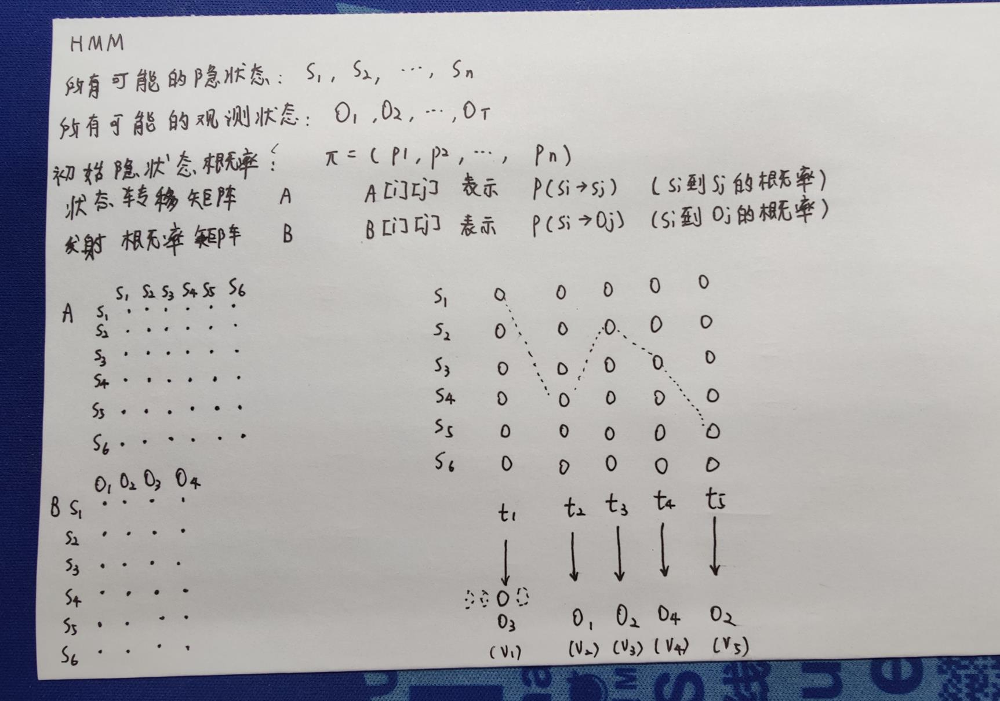
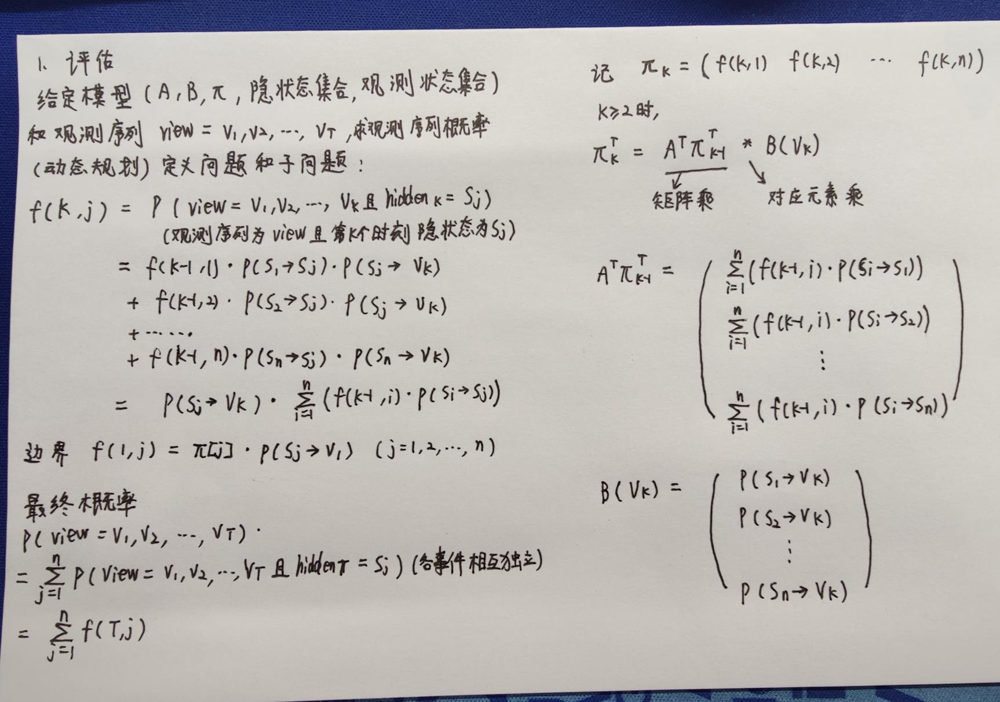

# NLP
- 本项目为NLP算法相关的代码和笔记，因此部分文件夹名称为中文。

- default_dict.txt为jieba的默认词典的复制，可通过`print(jieba.get_dict_file())`查看其位置。
- 请使用`git lfs clone`克隆本项目。

##### 关于NLP/隐马尔可夫/HMM.py的一些解释

0. HMM的定义

1. 评估问题

2. 解码问题

3. HMM的训练
   - 统计
   - 迭代
